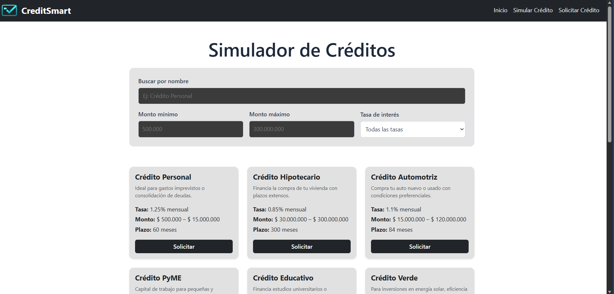
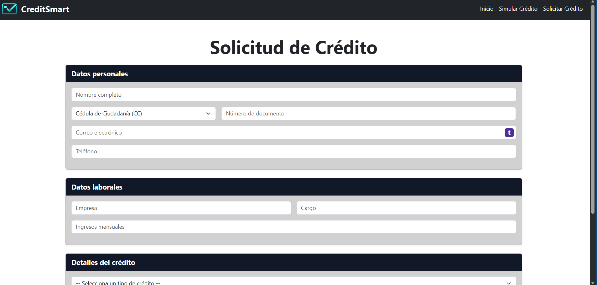

# CreditSmart

**Estudiante**: Víctor Manuel Quiceno Guerra  

## Descripción
Plataforma interactiva para la gestión de productos crediticios, que permite:
- Explorar créditos
- Simular y filtrar créditos por nombre, monto y tasa
- Solicitar créditos mediante un formulario

## Tecnologías utilizadas
- React (con Vite)
- React Router
- Bootstrap 5
- Hooks de React (`useState`, `useEffect`, `useMemo`, `useSearchParams`)

## Instrucciones de instalación
1. Clonar el repositorio
2. Ejecutar `npm install`
3. Ejecutar `npm run dev`
4. Abrir `http://localhost:5173`

## Capturas

