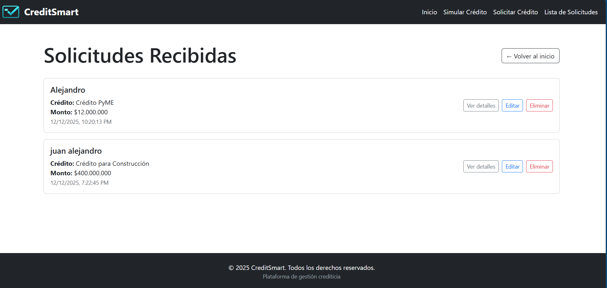

# CreditSmart

**Estudiante**: Víctor Manuel Quiceno Guerra

## Descripción

Plataforma interactiva para la gestión de productos crediticios, que permite:

- Explorar créditos cargados desde **Firebase Firestore**
- Simular y filtrar créditos por nombre, monto y tasa
- Solicitar créditos mediante un formulario validado
- **Guardar, consultar, editar y eliminar solicitudes en Firestore** (persistencia en la nube)
- Ver todas las solicitudes en una página dedicada, con opción de expandir detalles sin cambiar de página

## Tecnologías utilizadas

- React (con Vite)
- React Router
- **Firebase Firestore** (base de datos en la nube)
- Bootstrap 5
- Hooks de React (`useState`, `useEffect`, `useMemo`, `useSearchParams`)

## Instrucciones de instalación

1. Clonar el repositorio
2. Ejecutar `npm install`
3. Crear un archivo `.env` en la raíz con las credenciales de Firebase (ver `.env.example`)
4. Ejecutar `npm run dev`
5. Abrir `http://localhost:5173`

## Capturas

